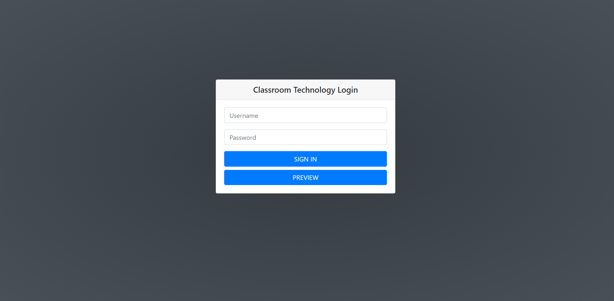
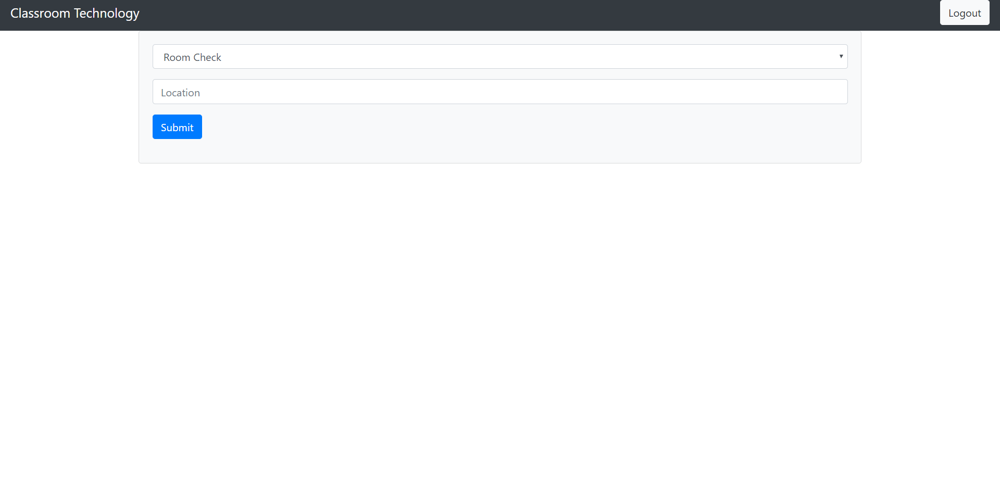
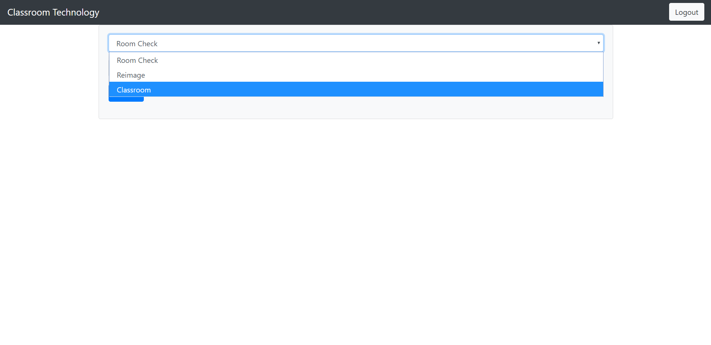

# Classroom-technology

A web app created for classroom technicians for managing classrooms status and information.

The web app can be accessed in the following website:
https://classroom-technology.herokuapp.com/

Most of the information is locked for admin but anyone can preview the site and functionality by clicking on the "Preview" button.

The web app will create a report or preview room status depending on the drop down option and room location

## Features to be added
* Editing Classroom information
* Creating Classroom reports
* Syncing with Astra to look up schedule
* Moving to React creating a singular page experience
* Adding a prediction on room status
